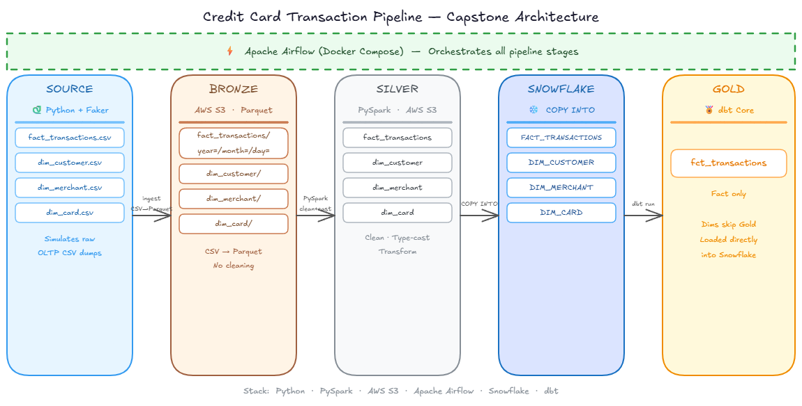

# Credit Card Transaction Pipeline

A production-style end-to-end data engineering pipeline built to simulate real-world fraud transaction data processing. This project demonstrates a modern lakehouse architecture using Python, PySpark, AWS S3, Snowflake, dbt, and Apache Airflow — orchestrated end-to-end via Apache Airflow running on Docker Compose.

---

## Architecture



> Apache Airflow (Docker Compose) orchestrates all pipeline stages. Dimension tables skip the Gold layer and are loaded directly into Snowflake — only `fct_transactions` goes through dbt transformation.

---

## Dataset

- **Source:** [Kaggle — Credit Card Fraud Detection](https://www.kaggle.com/datasets/kartik2112/fraud-detection)
- **Size:** ~1.85 million rows (fraudTrain.csv + fraudTest.csv combined)
- **Content:** Simulated credit card transactions including merchant details, customer demographics, transaction amounts, and fraud labels

---

## Pipeline Walkthrough

### 1. Data Generation (`dim_generation/`)
Raw Kaggle CSVs are used as the fact source. `dim_faker.py` reads the source data and generates normalized dimension tables:
- `dim_customer` — deduplicated on credit card number
- `dim_merchant` — deduplicated on merchant name, enriched with latest lat/long
- `dim_card` — Faker-enriched card details (expiry date, issue date, credit limit)
- `fact_transactions` — enriched with `cust_uuid` and `merch_uuid` foreign keys

All outputs are written as CSVs to the `landing/` folder, simulating raw OLTP CSV dumps.

### 2. Bronze Layer (`bronze/`)
PySpark reads CSVs from `landing/` and writes Parquet to S3 — raw format conversion only, no cleaning.
- Dims written flat → `s3://cc-transaction-pipeline/brz/brz_dim_*/`
- Fact partitioned by `year/month/day` using Hive-style partitioning for partition pruning

### 3. Silver Layer (`silver/`)
Cleaning and type casting happens here via PySpark:
- `slv_dims.py` — casts data types (zip→int, lat/long→double, dates→DateType), strips `"fraud_"` merchant prefix
- `slv_fact.py` — selects relevant columns, casts `cc_num` to string, written flat (no partitioning — feeds Snowflake directly)

### 4. Snowflake + Gold Layer (`dbt`) *(In Progress)*
Silver Parquet files are loaded into Snowflake via `COPY INTO`. dbt transforms raw Snowflake tables into a clean star schema:
- Dims loaded directly into Snowflake (skip Gold)
- `fct_transactions` built via dbt with staging models, joins, and data quality tests

### 5. Orchestration (`airflow/`)
Full pipeline orchestrated via a daily Airflow DAG:
```
bronze >> silver
```
- Retries: 3 attempts with 5-minute delay
- Backfill supported via Airflow UI
- Runs inside Docker Compose with a custom image (Java + PySpark baked in)

---

## Tech Stack

| Layer | Tool |
|---|---|
| Data Generation | Python, Faker |
| Ingestion & Transformation | PySpark |
| Storage | AWS S3 (Parquet, Medallion Architecture) |
| Warehouse | Snowflake |
| Transformation (Gold) | dbt Core |
| Orchestration | Apache Airflow (Docker Compose) |
| Language | Python 3.13 |

---

## Project Structure

```
CC Transaction Pipeline/
├── assets/
│   └── Capstone_Project_architecture.png
├── cfg/
│   └── config_template.py       # Template — copy to config.py and fill values
├── dim_generation/
│   └── dim_faker.py             # Generates dimension CSVs from source data
├── bronze/
│   └── brz.py                   # PySpark ingestion to S3 Bronze layer
├── silver/
│   ├── slv_dims.py              # Silver dimension cleaning
│   └── slv_fact.py              # Silver fact cleaning
├── airflow/
│   ├── dags/
│   │   └── my_dag.py            # Airflow DAG definition
│   ├── Dockerfile               # Custom Airflow image with Java + PySpark
│   ├── docker-compose.yaml      # Airflow local setup
│   └── requirements.txt         # Python dependencies
├── landing/                     # Generated CSVs (gitignored)
├── source/                      # Raw Kaggle CSVs (gitignored)
└── README.md
```

---

## Setup & How to Run

### Prerequisites
- Python 3.13
- Java JDK 17
- Docker Desktop
- AWS CLI configured (`ap-south-1`)
- Snowflake account

### Configuration
1. Copy `cfg/config_template.py` to `cfg/config.py`
2. Fill in your AWS credentials and local paths
3. Set `PROJECT_ROOT` environment variable if running inside Docker

### Running Locally
```bash
# Step 1 — Generate dimension data
python dim_generation/dim_faker.py

# Step 2 — Run Bronze ingestion
python bronze/brz.py

# Step 3 — Run Silver transformation
python silver/slv_dims.py
python silver/slv_fact.py
```

### Running via Airflow
```bash
cd airflow
docker compose up --build -d
# Open http://localhost:8080
# Trigger the DAG manually or wait for the daily schedule
```

---

## Key Design Decisions

- **Parquet over Delta Lake** — Gold layer is Snowflake which reads Parquet natively. Delta Lake benefits apply in Spark/lakehouse-native stacks like Databricks.
- **No partitioning on Silver fact** — Silver feeds Snowflake directly and is not queried via Spark, so partitioning adds no value.
- **Hive-style partitioning on Bronze fact** — enables partition pruning for downstream Spark reads.
- **PII handling in Silver** — data cleaning and PII drops belong in the transformation layer, not in data generation scripts.
- **Dims skip Gold** — dimension tables are stable and load directly into Snowflake. Only the fact table goes through dbt transformation.
